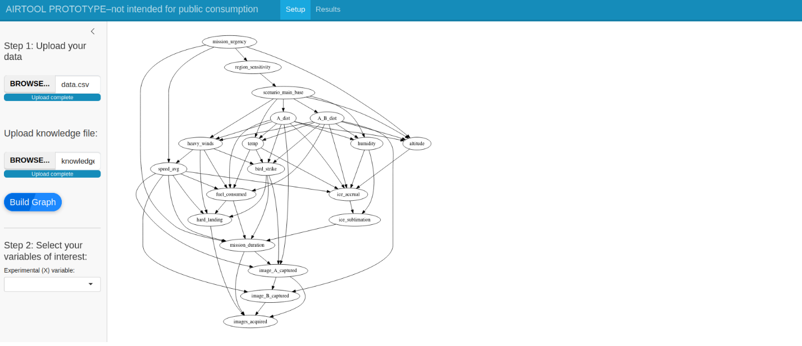

AIR Tool

Copyright 2024 Carnegie Mellon University.

NO WARRANTY. THIS CARNEGIE MELLON UNIVERSITY AND SOFTWARE ENGINEERING INSTITUTE
MATERIAL IS FURNISHED ON AN "AS-IS" BASIS. CARNEGIE MELLON UNIVERSITY MAKES NO
WARRANTIES OF ANY KIND, EITHER EXPRESSED OR IMPLIED, AS TO ANY MATTER
INCLUDING, BUT NOT LIMITED TO, WARRANTY OF FITNESS FOR PURPOSE OR
MERCHANTABILITY, EXCLUSIVITY, OR RESULTS OBTAINED FROM USE OF THE MATERIAL.
CARNEGIE MELLON UNIVERSITY DOES NOT MAKE ANY WARRANTY OF ANY KIND WITH RESPECT
TO FREEDOM FROM PATENT, TRADEMARK, OR COPYRIGHT INFRINGEMENT.

Licensed under a MIT (SEI)-style license, please see license.txt or contact
permission_at_sei.cmu.edu for full terms.

[DISTRIBUTION STATEMENT A] This material has been approved for public release
and unlimited distribution.  Please see Copyright notice for non-US Government
use and distribution.

This Software includes and/or makes use of Third-Party Software each subject to
its own license.

DM24-1686

---
editor: 
  markdown: 
    wrap: 72
---

**Title: AI Robustness (AIR) Tool**

**Version: 2.3.0**

**Release Date: 12/18/2024**

## Introduction

-   **Brief Overview:** Modern analytic methods, including Artificial
    Intelligence (AI) and Machine Learning (ML) classifiers, depend on
    correlations; however, such approaches often fail to account for
    confounding in the data, which prevents accurate modeling of cause
    and effect, which often leads to prediction bias. The AI Robustness
    (AIR) tool allows users to gauge AI/ML classifier performance with
    unprecedented confidence.

-   **Target Audience:** Projects that have an established AI classifier
    workflow, complete with data dictionaries and subject-matter
    experts. These release notes are for potential partners that would
    like to install the AIR tool in their own environment.

## New Features

-   **Detailed Descriptions:** Initial release.

-   **Benefits:** NA for this release.

-   **Screenshots or Visuals:** (see tutorial)

## System Requirements and Installation

AIR tool can be installed at partner site or run in the SEI environment.
Classified options are not available at the SEI at this point.

**Requirements for running AIR:**

-   **Hardware:**

    -   10+GiB of storage + any additional for your data

    -   12GiB+ memory (Estimate is based on our testing, but may vary)

-   **Software:**

    -   Docker-capable system (i.e., Linux/Mac/Windows)

    -   WSL2/Docker/Docker Desktop software

    -   A text editor

    -   A web browser (used for viewing/interacting with local .html
        files)

-   **User:**

    -   Permissions to run a Docker container and any other supporting
        tools

    -   Local copies of datasets to use with the AIR tool

## Model and Data Requirements

The AIR Tool has requirements for data and model that must be followed
for it to work properly. This is important for the user to understand
before using the tool.

-   Model:

    -   The model must be an AI/ML classifier that operates on
        structured or tabular data, relying on numerical, categorical\*,
        or time-series features, rather than unstructured data such as
        images, audio, or natural language text.

    -   Unsupervised models, text classifiers, image classifiers, and
        most applications of generative AI are not currently supported.

    -   Must have a single outcome variable that the classifier is
        predicting. This could be something like mission success, threat
        assessment, component failure, etc...

    -   Must be run against multiple scenarios to predict outcome above.
        For example, does location affect mission success, does
        operating system affect threat assessment, does weather affect
        component failure, etc...

    -   Must be compatible with use in an R environment and be able to
        utilize a predict() function OR allow the user to predict output
        given user-defined input (to predict ATE).

    -   Must not require GPU acceleration or external hardware not
        currently supported by the tool.

-   Data:

    -   Must be .csv formatted.

    -   Must be tabular format with header specifying variable names.

    -   Must contain all variables used in the model provided (where
        applicable).

    -   Variable names in data file must be identical to those in
        provided model (where applicable).

    -   Data and model are recommended to contain less than 1,000 or so
        variables. Above this threshold, behavior of causal discovery
        algorithms may slow significantly.

    -   All categorical variables must be one-hot encoded.

    -   All time-series data must be consistently formatted.

    -   No missing or null entries in the data.

    -   Features must have variability (i.e., no constant columns) and
        not be intentional duplicates of one another.

### Installation Instructions

Having met the usage requirements above, installation is a matter of
copying the container to a location that is accessible from the Docker
host. You'll want to have your data and knowledge files accessible to
the Docker host as well. A sample run command for using the container
would be:

*docker run -it -p 4173:4173 -u root --rm --name airtool
airtool-image:latest*

Flag definitions:

-   4173: Default port that the development server runs on, it can be
    re-mapped if this port is inconvenient in your environment by simply
    changing the docker command.

-   '-u root': Indicates what user the process inside the container will
    think it is running as (Note: Does not mean you need root
    permissions to run the container)

-   '--rm': Indicates to remove the container after you've finished with
    it. If you wish to keep it around, remove this parameter.

-   '--name': provides the name Docker will use to refer to this
    container. This is important, as if you don't choose a name, a new
    one will be assigned every time you run the container. If you are
    not removing the container, you will soon find you are running out
    of hard drive storage, after a handful of runs.

-   'airtool-image:latest': is the tagged name for the container. If you
    loaded the image to a local registry, using:

*docker load \< airtool.tar*\
*docker tag airtool-image:latest*

then the container will be viewable in your local docker registry,
using:

*docker images*

You may wish to add a data volume to your container. A limitation of the
current release is that intermediate products are not stored within the
container. I.e., every run starts from a new state.

## Getting Started

**Step 1: Building your Causal Graph**

{width="6.5in"
height="2.807638888888889in"}

The tool will first prompt the user for their data file. This file
should conform to the characteristics outlined in the "Model and Data
Requirements" section above. This file is most helpful if it is either
the same data that was used to build the AI classifier in question or if
it is data that is otherwise fed (or could be fed) to the AI classifier
to make predictions.

After a data file is uploaded, the user will then select their knowledge
file for upload. Knowledge files used here will define rough hierarchies
of three or more levels of causation as determined logically or by
subject matter experts. Levels are defined as follows:

-   **Tier 0 -- Exogenous variables:** These variables are not
    influenced by any other variables. Often used as starting points for
    causal graphs.

-   **Tier 1 -- Endogenous variables:** Variables in this tier are
    potentially influenced by those in tier 0 and possibly other tier 1
    variables.

-   **Tier 2 and up -- Higher-tier variables:** These variables may be
    influenced by any preceding tiers or its own. There can be any
    number of tiers, though as few as three tiers are strictly
    necessary.

Currently, all knowledge assertions will need to be done ahead of time
by the user as in-place editing is not yet supported by the tool. The
file format should be similar to the data file (i.e., .csv tabular
format with header), but will contain only two columns: level and
variable, where level contains a value for tier, 0-n, and variable
contains the variable name as written in the data file (must match
exactly with each). ). Each variable name should be represented exactly
once and on its own line (i.e., file must contain all names), each with
a corresponding numeric value in the 'level' column.

Once both files are uploaded and accepted a new button, "Build Graph,"
will appear. Once activated, the tool will run Causal Discovery
algorithms to build your causal graph and display it in the main panel
(right). If you are unsatisfied with the graph and feel that updating
your data and/or knowledge file might help, you can select new files and
re-build your graph until satisfied.

**Step 2: Identifying potential sources of bias**

{width="6.5in"
height="2.795138888888889in"}

The tool will now prompt users for additional information about the
problem the classifier is attempting to solve. Most important will be
identifying both the experimental/treatment (x) and outcome (y)
variables. Each variable definition will be pulled from the data file
(above).

> *Note: in the current version of the tool, both x and y variables must
> be treated as binary. Both variables will prompt the user for
> definitions as to what constitutes "treated" vs "untreated" and
> "success" vs "fail" for both the x and y variables, respectively. Data
> distributions are displayed on the right of the setup pane to help the
> user visualize their decision criteria.*

Once the user has completed their definitions for experimental/treatment
(x) and outcome (y) variables, they may click on the "Update Graph"
button to complete this step. Activating the "Update Graph" button will
run the causal identification algorithms in AIR, resulting in changes to
your causal graph (right) that highlights:

-   both x and y variables (in yellow)

-   two separate adjustment sets identified by AIR

    -   potential confounders that are parents of x and y in medium gray

    -   potential confounders that are parents of x and intermediate
        variables and/or y in light gray.

As in step 1, the user may continue making edits to this section until
they are satisfied but must always click the "Update Graph" button once
finished for the changed inputs to take effect.

**Step 3: Estimating the causal effect to compare with your AI
Classifier**

{width="6.5in"
height="2.7930555555555556in"}

The tool will now prompt the user for information about their classifier
to be tested. This section is context-dependent, so a user's selection
will generate different input boxes accordingly. Users have three
options available to them, currently, including:

-   Uploading their model -- this choice prompts the user to upload a
    copy of their model used to estimate the average treatment effect
    predicted by their model to compare against the causally-derived
    estimates of AIR. Currently, this tool only accepts models in the
    .rda format, but more can be added upon request. Once selected, a
    file upload prompt will appear below.

-   Providing an ATE -- if the user can calculate their own average
    treatment effect (ATE) of their model, they can input that directly
    here. Once selected, an ATE input box will appear below. See
    "Generating your own ATE" below for more information.

-   No information (do it all for me) -- this last option is for a user
    who doesn't have a specific model but would like the tool to
    generate several commonly-used machine learning models and compare
    against the causally-derived model of AIR. No additional input
    required.

Once the user has made a selection, they can click the "Calculate
Results" button to finish the causal estimation portion of the tool.
Once this process has started, it cannot be undone, so be careful and
make sure you are ready. This process will inevitably take some time to
complete. In our trials with a fairly simple model this usually takes
2-5 minutes to run. Once complete, the progress bar will disappear then
navigate to the "Results" tab using the blue ribbon at the top of the
tool screen.

**Results**

{width="6.5in"
height="2.795138888888889in"}

This page requires no input from the user but will display the entire
health report. It contains the following contents:

-   (Left) -- the user can find their causal graph with both x and y
    variables highlighted in yellow. If additional nodes are found to be
    contributing significant bias to the results, they will also be
    highlighted in red (their inclusion will be discussed later in the
    "Interpreting your results" section).

-   (Top Right) -- the user can find a 'ribbon plot' that displays a
    summary of the average treatment effect and associated 95%
    confidence interval associated with both adjustment sets (medium and
    light grey). Any values inside both sets of 95% confidence intervals
    are shaded green, values inside only one set of intervals is yellow,
    and outside both is red, while your classifier's average treatment
    effect will be indicated by an arrow on the line. These causal
    intervals provide two independent checks on the behavior of the
    classifier on a use case of interest. If one of the two intervals is
    violated, that might not be statistically relevant, but could also a
    warning to monitor classifier performance for that use case
    regularly in the future. If both are violated, the consumer of
    classifier predictions should be wary of predictions for that
    particular use case. The two adjustment sets that are output of AIR
    Step 2 provide recommendations of what variables/features to focus
    on for subsequent classifier retraining. Below the plot will be a
    figure caption describing how to interpret this particular plot and
    what each of the values means.

-   (bottom right) -- the user will find a custom text-based
    interpretation summarizing the results from all steps. These
    interpretations are automatically-generated from the analyses and
    are unique to each session.

*Generating your own ATE*

In the event that you will be providing your own average treatment
effect (ATE), the AIR Tool will accept ATE values calculated using
potential outcome prediction. The calculation is relatively simple. In
practice, you cannot observe both $Y_{1}$​ (observed treated outcome) and
$Y_{0}$​ (observed untreated outcome) for the same individual, so we will
rely on the model to simulate these outcomes for us. For each individual
data point in the dataset, we first calculate the potential outcomes as:

-   ${\widehat{Y}}_{1}$: the predicted outcome where the treatment value
    for all individuals is manually set to 1 ($T = 1$).

-   ${\widehat{Y}}_{0}$: the predicted outcome where the treatment value
    for all individuals is manually set to 0 ($T = 0$).

Next, we use these predicted outcomes to calculate ATE. This value is
simply the average difference between the two potential outcomes:

$$ATE = \frac{1}{N}\sum_{i = 1}^{N}{({\widehat{Y}}_{1i} - \ {\widehat{Y}}_{0i})}\ $$

## Known Issues/Limitations

**Existing Problems:** Issues that are still present in the current
release will be revealed with further testing.

**Limitations:**

-   Currently this tool is only equipped to handle binary (in the on/off
    or true/false sense) treatment and binary outcome variables. This is
    largely due to the differences in interpretation resulting from the
    different analyses they require. As a workaround, we provide a
    built-in tool to transform continuous variables into binary (as part
    of step 2).

-   This tool only accepts .rda files for model upload. This is largely
    due to lack of interest but if you have a different model format
    you'd like to use, let us know and we'll try to get your model type
    working!

-   This tool does not actually fix your model but provides a health
    report that identifies areas/variables where bias is likely being
    introduced. It is up to the user to identify and apply appropriate
    remediations based on this information to ensure that their
    classifier is producing the desired results.

## Contact and Support Information

-   **Support Channels:** How users can reach out for help (e.g., email,
    support portal).

-   **Feedback Mechanism:**
    [tailor-help\@sei.cmu.edu](mailto:tailor-help@sei.cmu.edu){.email}

## Roadmap or Future Updates

-   **Upcoming Features:** Coming soon.

-   **Planned Enhancements:** Coming soon.

## Security Information

In the current AIR tool, data is not saved or used for any purpose,
other than specified above. When the tool has finished running, the
state is not saved for future use. The user is responsible for the
handling of their source data.

## Licensing and Legal Information

-   **Licensing Terms:** Clarify the usage rights and any licensing
    requirements.

-   **Legal Disclaimers:** Include necessary legal notices.
