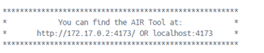

# AIR Tool Installation Instructions   

## 1. Open Docker Desktop 

If you don’t have a Docker Desktop, you can download here:
[https://www.docker.com/get-started/](https://www.docker.com/get-started/)

Docker Desktop may require security policy permissions/changes, depending upon your organization’s current security ecosystem.

## 2. Download, extract, and run the AIR Tool container from GitHub.

In Docker Desktop, open the Terminal by clicking on that button at the bottom right of the window. 

In the Terminal, enter command: 

**docker run --rm --name airtool -it -p 4173:4173 ghcr.io/cmu-sei/airtool-dev:v0.12.0**

Terminal status should indicate the progress of downloading and extracting the container. 
This step only downloads and extracts if there is a new container that you have not already downloaded.  The download and extract will not occur if you already have the current AIR Tool container. 
When complete, the Terminal should produce welcome message with /workspace prompt: 

 

## 3.  Initiate the AIR Tool scripts for User Interface.

At /workspace prompt enter command:

**scripts/run_quarto.sh**

When this command is complete, you will see these browser navigation instructions:  

 

## 4.	Access the AIR Tool User Interface in a browser. 

The AIR user interface can be accessed on Chrome, Safari, Edge and Firefox browsers. 

> Linux OS browser link prompt such as: http://172.17.0.2:4173/   
> Windows OS browser link is:  localhost:4173/ 

When link loads page in browser (may require approx. 30 seconds and/or browser refresh), you should see:  

 

For additional instructions about using the AIR Tool, please refer to [Getting Started Guide](./getting_started.md) 
