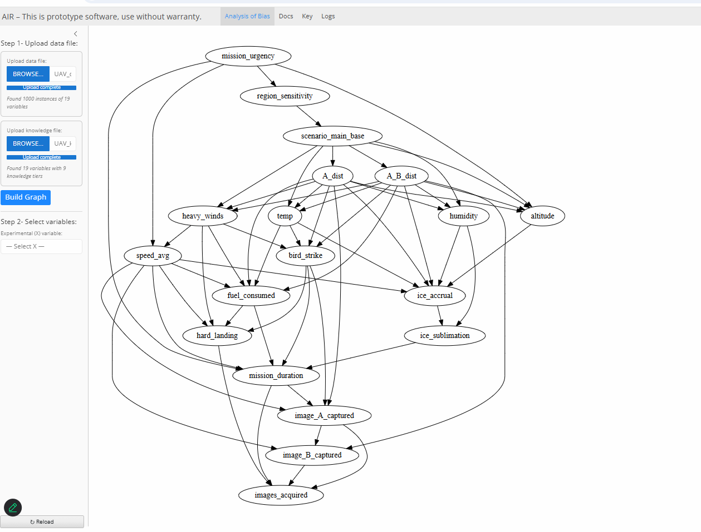

# Installation Instructions

Installation is a matter of copying the container to a location accessible from the Docker host. You'll want to have your data and knowledge files accessible to the Docker host as well.

> **Note:** A limitation of the current release is that intermediate products are not stored within the container — every run starts from a new state. You may wish to add a data volume to your container to work around this.

## Step 1: Open Docker Desktop

If you don't have Docker Desktop, you can download it here: <https://www.docker.com/get-started/>

> **Note:** Docker Desktop may require security policy permissions or changes depending on your organization's current security ecosystem.

## Step 2: Download, Extract, and Run the AIR Tool Container from GitHub

In Docker Desktop, open the Terminal by clicking the button at the bottom right of the window.

In the Terminal, enter the following command (replace `1.1.1` with the latest version number):

```
docker run --rm --name airtool -it -p 4173:4173 ghcr.io/cmu-sei/airtool-dev:v1.1.1
```

The Terminal will indicate the progress of downloading and extracting the container. This step only downloads and extracts if there is a new container version not already downloaded. When complete, the Terminal will display a welcome message with a `/workspace` prompt.


 

## Step 3: Initiate the AIR Tool Scripts for the User Interface

At the `/workspace` prompt, enter:

```
scripts/run_quarto.sh
```

When this command completes, a URL will appear in the terminal.


## Step 4: Access the AIR Tool User Interface in a Browser

The User Interface is accessible on Chrome, Safari, Edge, and Firefox.

- **Linux OS:** `http://172.17.0.2:4173/`
- **Windows OS:** `localhost:4173/`

When the page loads (may require approximately 30 seconds or a refresh), the AIR Tool interface will appear.


