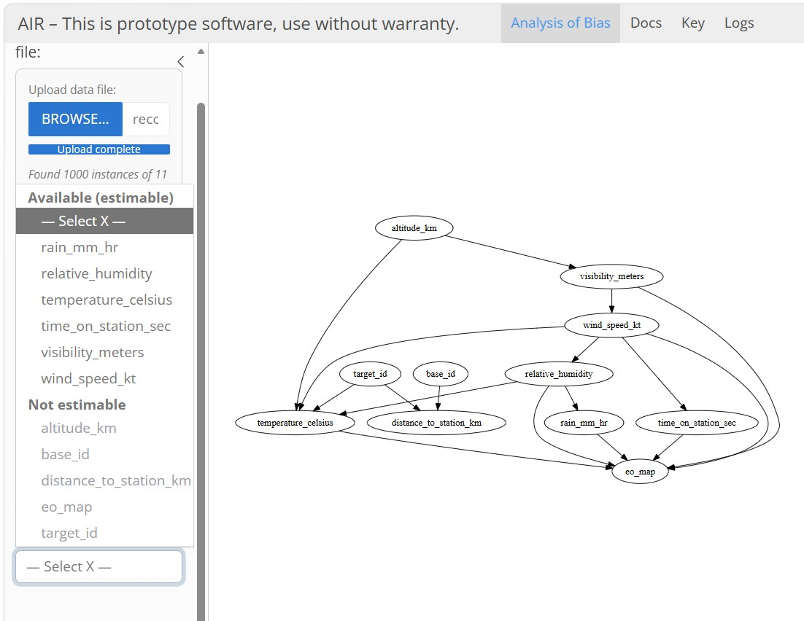
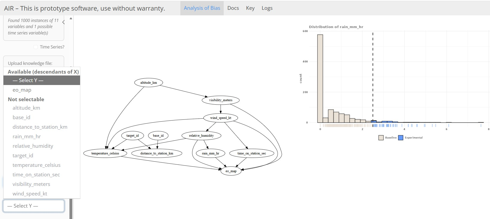
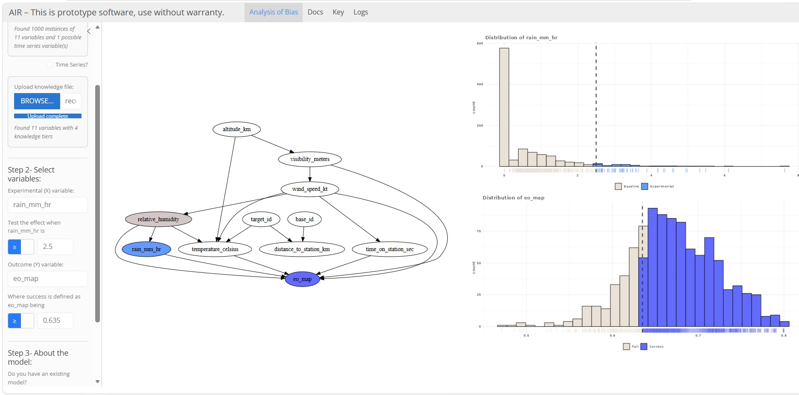

# Step 2: Identifying Potential Sources of Bias

The tool will now prompt you for additional information about the causal scenario that you wish to analyze.

## Selecting Treatment and Outcome Variables

The most important step is identifying both the experimental/treatment (x) and outcome (y) variables for the scenario to be analyzed.

### The experimental (x) variable can be selected from variables in the data file uploaded in Step 1. Variables with no inputs or no outputs cannot be selected.

 
  
### The outcome (y) variable can be selected from the causal successors of the selected experimental (x) variable.

 

In the current version of the tool, both x and y variables must be treated as binary. Users define what constitutes "treated" vs. "untreated" and "success" vs. "fail" for the x and y variables, respectively. Data distributions are displayed on the right of the setup pane to help visualize decision criteria.

## Results of Causal Identification

Once you have completed your definitions, AIR will run the causal identification algorithms, resulting in changes to the causal graph that highlight:

- Both experimental/treatment (x) variable (blue) and outcome (y) variable (purple)
- Two separate adjustment sets identified by AIR
- Potential confounders that are parents of x and y (medium gray)
- Potential confounders that are parents of x and intermediate variables and/or y (light gray)

 
