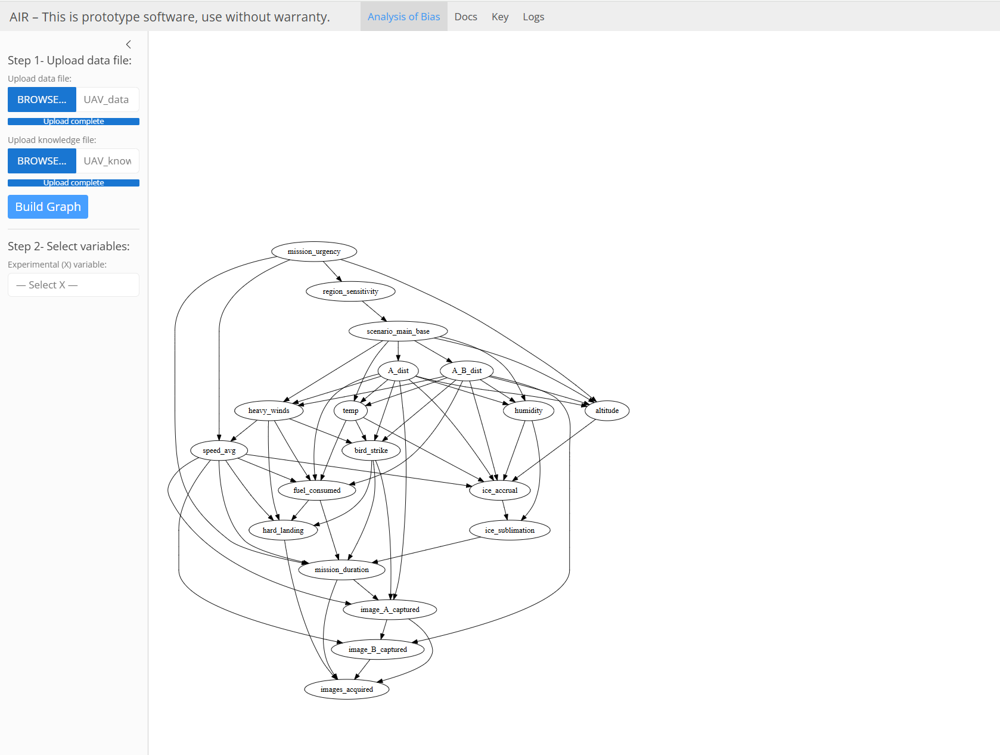
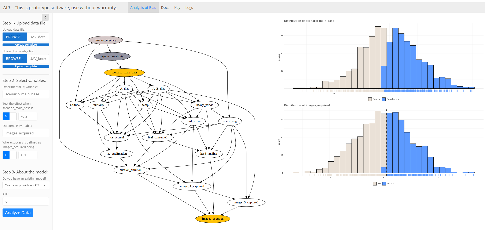
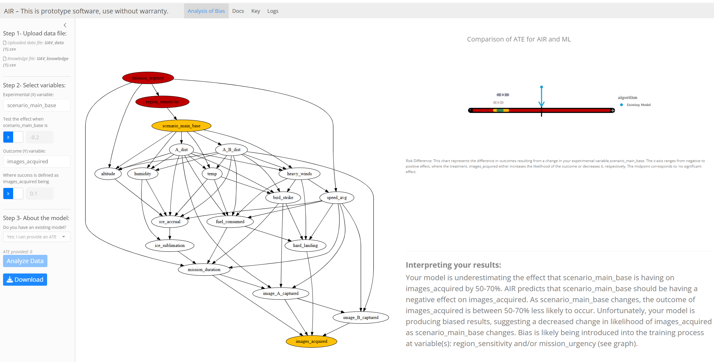

# Getting Started Guide

## Introduction

Modern analytic methods, including Artificial Intelligence (AI) and Machine Learning (ML) classifiers, depend on correlations; however, such approaches often fail to account for confounding in the data, which prevents accurate modeling of cause and effect, which often leads to prediction bias. The AI Robustness (AIR) tool allows users to gauge AI/ML classifier performance with unprecedented confidence.

Target Audience:
Projects that have an established AI/ML model workflow, complete with data dictionaries and subject-matter experts.

## Requirements for Running AIR

AIR tool can be installed at a partner site or run in the SEI environment. Classified options are not available at the SEI at this point.

### Hardware:
- 16 GB of storage (20GB recommended) + any additional for your data
- 12GB+ memory (Estimate is based on our testing, but may vary)

### Software:
- Docker-capable system (i.e., Linux/Mac/Windows)
- WSL2/Docker/Docker Desktop software
- A text editor
- A web browser (used for viewing/interacting with local .html files)

### User:
- Permissions to run a Docker container and any other supporting tools
- Local copies of datasets to use with the AIR tool

### Model (if AIR analysis is intended for existing model):
- be an AI/ML model (e.g., classifier) that operates on structured or tabular data, relying on numerical, categorical, or time-series features, rather than unstructured data such as images, audio, or natural language text
- Should have a single outcome variable that the classifier is predicting. This could be something like mission success, threat assessment, component failure, etc.
- Should be run against multiple scenarios to predict outcome above. For example, does location affect mission success, does operating system affect threat assessment, does weather affect component failure, etc.
- Should be compatible with use in an R environment and be able to utilize a predict() function – **OR** - allow the user to predict output given user-defined input to predict Average Treatment Effect (ATE)
- Must not require GPU acceleration or external hardware not currently supported by the tool
- Unsupervised models, text classifiers, image classifiers, and most applications of generative AI are not currently supported

### Data:
- Must be tabular .csv format with header specifying variable names with no spaces in the variable names
- Must contain all variables used in the model provided (where applicable)
- Variable names in data file must be identical to those in provided model (where applicable)
- Data and model are recommended to contain less than 1,000 or so variables. Above this threshold, behavior of causal discovery algorithms may slow significantly
- All categorical variables must be one-hot encoded
- All time-series data must be consistently formatted
- No missing or null entries in the data
- Features must have variability (i.e., no constant columns) and not be intentional duplicates of one another

More information about Data Requirements can be found in [AIR Tool Dataset Guidelines](./dataset_guidelines.md)

## Installation Instructions

Having met the usage requirements above, installation is a matter of copying the container to a location that is accessible from the Docker host. Detailed instructions can be found in [AIR Tool Installation Instructions](./Installation_Instructions.md)

You'll want to have your data and knowledge files accessible to the Docker host as well.

You may wish to add a data volume to your container. A limitation of the current release is that intermediate products are not stored within the container, i.e., every run starts from a new state.

## Getting Started

### Step 0: Preparing the Scenario

Before beginning analysis with the tool, it is useful to carefully consider the causal scenario that the classifier model is used to solve. Understanding the scenario variables to be analyzed and confirming completeness of the data will contribute to gaining insight from the AIR results.

More detailed information about preparing the scenario and data for analysis can be found in [Scenario Definition Worksheet](./scenario_definition_worksheet.md) and [Dataset Guidelines](./dataset_guidelines.md) 

### Step 1: Building your Causal Graph

Once the AIR tool is successfully installed, it will open in the web browser.

More detailed instructions can be found in [AIR Tool Installation Instructions](./Installation_Instructions.md)

The tool will first prompt the user to upload their data file. This file should conform to the characteristics outlined in the "Model and Data Requirements" section above. This file is most helpful if it is either the same data that was used to build the AI classifier in question or if it is data that is otherwise fed (or could be fed) to the AI classifier to make predictions. The blue status bar will confirm when upload is complete.

After a data file is uploaded, the user will then be prompted to upload the knowledge file. The knowledge file will define rough hierarchies of two or more levels of causation as determined logically or by subject matter experts. Levels are defined as follows:

- Tier 0 -- Exogenous variables: These variables are not influenced by any other variables. Often used as starting points for causal graphs. 
- Tier 1 -- Endogenous variables: Variables in this tier are potentially influenced by those in tier 0 and possibly other tier 1 variables.
- Tier 2 and up -- Higher-tier variables: These variables may be influenced by any preceding tiers or its own. There can be any number of tiers, though as few as three tiers are strictly necessary.

Currently, all knowledge assertions will need to be done ahead of time by the user as in-place editing is not yet supported by the tool. The file format should be similar to the data file (i.e., .csv tabular format with headers), but will contain only two columns: level and variable, where level contains a value for tier, 0-n, and variable contains the variable name as written in the data file (the variable names must match exactly).  Each variable name should be represented exactly once and on its own line (i.e., file must contain all names), each with a corresponding numeric value in the 'level' column.

More detailed information about creating a knowledge file can be found in [AIR Tool Knowledge File Guidance](./knowledge_file.md) 

The blue status bar will confirm when each upload is complete. The tool will provide a notification if errors are discovered during the upload. Once both the data and knowledge file files are uploaded and accepted a new button, "Build Graph," will appear. Once activated, the tool will run Causal Discovery algorithms to build your causal graph, provide a notification when the causal graph is complete with a Continue notification. The tool will then display the causal graph in the main panel (right). If you are unsatisfied with the graph and feel that updating your data and/or knowledge file might help, you can select new files and re-build your graph until satisfied.

More detailed information about assessing causal graphs can be found in [AIR Tool Causal Graph Insights](./causal_graph_checks.md)

 

### Step 2: Identifying potential sources of bias

The tool will now prompt users for additional information about the problem scenario that the classifier is attempting to solve. Most important will be identifying both the experimental/treatment (x) and outcome (y) variables. The experimental (x) variable definition will be pulled from the data file uploaded in Step 1.  Experimental (x) variables that have no inputs or no outputs cannot be selected in the tool. The Outcome (y) variables available in tool will be the causal successors of the selected Experimental (x) variable.

In the current version of the tool, both x and y variables must be treated as binary. Users will define what constitutes “baseline” vs. “experimental” and “success” vs. “fail” for the x and y variables, respectively. Data distributions are displayed on the right of the setup pane to help visualize decision criteria.

Once the user has completed their definitions for experimental (x) and outcome (y) variables, AIR will run the causal identification algorithms, resulting in changes to your causal graph that highlights:
- both experimental/treatment (x) variable (blue) and outcome (y) variable (purple)
- two separate adjustment sets identified by AIR
	- potential confounders that are parents of x and y in medium gray
	- potential confounders that are parents of x and intermediate variables and/or y in light gray.

 

### Step 3: Estimating the causal effect to compare with your model 

The tool will now prompt the user for information about their model that is to be tested. This section is context-dependent, so a user's selection will generate different input boxes accordingly. Users have three options available to them, currently, including:

- Uploading their model -- this choice prompts the user to upload a copy of their model used to estimate the average treatment effect predicted by their model to compare against the causally-derived estimates of AIR. Currently, this tool only accepts models in the .rda format, but more can be added upon request. Once selected, a file upload prompt will appear below.

- Providing an ATE -- if the user can calculate their own average treatment effect (ATE) of their model, they can input that directly here. Once selected, an ATE input box will appear below. See [Calculating ATE](./calculating_ATE.md) for more information.

- No: Do it all for me -- this option is for a user who doesn't have a specific model but would like the tool to generate several commonly-used machine learning models to compare against the causally-derived model of AIR. No additional input required.

- No: Just show me the effect --  this option will allow user to proceed with the AIR analysis without any comparison of the AIR results to a predictive model. 

Once the user has made a selection, you can click the "Calculate Results" button to finish the causal estimation portion of the tool. After this process has started, it cannot be undone, so be careful and make sure you are ready. This process will inevitably take some time to complete. In our trials with a fairly simple model this usually takes 2-10 minutes to run. Once complete, the progress bar will disappear and the results will be displayed.

 

### Results

This page requires no input from the user but will display the entire health report. It contains the following contents:

(Left) -- the user can find their causal graph with both x and y variables highlighted in blue/purple. If additional nodes are found to be contributing significant bias to the results, they will also be highlighted in red (their inclusion will be discussed later in the "Interpreting your results" section).

(Top Right) -- the user can find a 'ribbon plot' that displays a summary of the average treatment effect and associated 95% confidence interval associated with both adjustment sets (medium and light grey). Any values inside both sets of 95% confidence intervals are shaded green, values inside only one set of intervals are yellow, and outside both is red, while your classifier's average treatment effect will be indicated by a blue arrow on the line. These causal intervals provide two independent checks on the ATE behavior of the model on the scenario of interest. If one of the two intervals is violated, that might not be statistically relevant but could also a warning to monitor model performance for that use case regularly in the future. If both are violated, the consumer of model predictions should be wary of predictions for that particular scenario. The two adjustment sets that are output provide recommendations of what variables/features to focus on for subsequent classifier retraining. Below the plot will be a figure caption describing how to interpret this particular plot and what each of the values means.

(Bottom Right) -- the user will find a custom text-based interpretation summarizing the results from all steps. These interpretations are generated from the analyses and are unique to each session.

The blue Download button on the lower left will allow users to download a PDF summary of these results.

More detailed information about interpreting AIR results can be found in: [Interpreting AIR Results]("./interpreting_results.md)  

Refreshing the browser or clicking the "Reload" button to the lower left will reset the tool and allow the user to begin a new analysis.

 
## Known Issues/Limitations

## Existing Problems:

Issues that are still present in the current release will be revealed with further testing.

## Limitations:

Running the AIR tool multiple times on the same full dataset is not a good idea because it increases the risk of false discoveries due to multiple comparisons. Each run introduces a chance of identifying spurious associations that may appear statistically significant but are actually artifacts of random noise. Every time you run a different analysis on the same data, you increase the likelihood that you'll misidentify some random noise as significant. In the case that it's important to conduct multiple analyses, it's recommended to use different version of the full dataset (whether subsets/partitions or new datasets entirely) to avoid this increased likelihood of statistical error.  (Note: This phenomenon is true in any statistical analysis and isn't specific to the AIR Tool.)

Currently this tool is only equipped to handle binary (in the on/off or true/false sense) treatment and binary outcome variables. This is largely due to the differences in interpretation resulting from the different analyses they require. As a workaround, we provide a built-in capability to transform continuous variables into binary (described above).

This tool only accepts .rda files for model upload. If you have a different model format you'd like to use, let us know and we'll try to get your model type working!

This tool does not actually fix your model but provides a health report that identifies areas/variables where bias is likely being introduced. The user will then need to identify and apply appropriate remediations based on this information to ensure that their classifier is producing the desired results.

# Contact and Support Information

Support Channels: How users can reach out for help (e.g., email, support portal).

Feedback Mechanism: tailor-help@sei.cmu.edu{.email}

Roadmap or Future Updates

Upcoming Features: Coming soon.

Planned Enhancements: Coming soon.

# Security Information

In the current AIR tool, data is not saved or used for any purpose, other than specified above. When the tool has finished running, the state is not saved for future use. The user is responsible for the handling of their source data.

# Licensing and Legal Information

[https://github.com/cmu-sei/causal-lair/tree/main?tab=License-1-ov-file](https://github.com/cmu-sei/causal-lair/tree/main?tab=License-1-ov-file)
