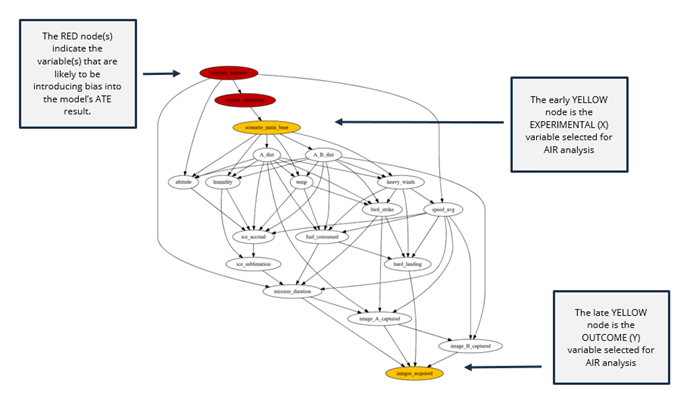

# Interpreting AIR Tool Results

When you complete an analysis in AIR, you will be presented with two visualizations and a brief explanation of the results.

## Risk Difference Chart 

The **Risk Difference** chart compares the average treatment effect (ATE) estimated by the AIR tool with the AI/ML model’s ATE of the experimental variable (a.k.a., “scenario variable” and “treatment variable”) on the outcome variable (a.k.a., “response variable”). The AIR tool ATE estimates are combined at the bottom of the chart into a single long horizontal red-yellow-green bar that serves as a reference for determining whether there is bias in your AI/ML model’s classifications.

The x-axis of the Risk Difference chart ranges from negative to positive effect, where a change in treatment either decreases the likelihood of the outcome or increases it, respectively. The midpoint corresponds to no statistically significant effect detected of treatment on outcome.
 
 

### Interpretations of the Risk Difference Chart 
- If your model’s ATE BLUE arrow is in a GREEN region: This means that statistical testing failed to find evidence of confounding bias in the predictions from your AI/ML model. As you continue to use your model for outcome prediction, you may want to periodically re-test just in case something has changed in the data, their distribution, or their sources. 

- If your model’s ATE BLUE arrow is in a YELLOW region: This means that there is some evidence of bias, but it is weak/uncertain. We recommend you continue to use the AIR Tool to monitor that experimental-predicted outcome relationship in case the BLUE arrow ATE moves into the RED region, signifying that the confounding bias may have gotten worse.  

- If your model’s ATE BLUE arrow is in a RED region: This means there is statistically-significant evidence that your AI/ML model exhibits confounding bias in predicting outcomes. To remedy this, you might want to consider obtaining better measures, if possible, of the other variables, as well as more training data reflecting a range of values for the variables in the adjustment sets and re-train your classifier; or even adjusting the algorithm or AI/ML modeling approach. This situation is harder to fix than the others as there is no guarantee that additional training will de-bias your AI/ML model—it may continue to underestimate or overestimate the outcome (on average). If in spite of your efforts to correct the situation, your (revised) model continues to make biased predictions, you might want to consider modeling the bias itself and adjusting the output of your model accordingly.  (This may be very hard.) 

## Causal Graph 

The **Causal Graph** indicates which variables are likely to be causing a confounding of the relationship between the experimental variable and the outcome variable.  If your AI/ML model’s ATE is not within both of the ATE 90% confidence intervals calculated by the AIR tool, then the red variables (or their causal ancestors) are likely to be introducing bias into your model’s results.  

 

If your AI/ML model’s ATE is within the ATE 90% confidence intervals calculated by the AIR tool, then the red nodes are simply informative for future potential bias. 

## Special Circumstances to Watch for in AIR Results 

### The two 90% confidence intervals do not overlap 
This can happen for one of three reasons: (1) The data in the dataset is of poor quality (some kind of measurement error), in which case you should revisit how the data is defined and collected and entered into the dataset. (2) There is an unmeasured confounder that is not being blocked by at least one of the two adjustment sets, in which case you should attempt to identify such missing variable(s) and determine how it might be measured in the future. (3) There is an error in Causal Discovery or Causal Identification algorithm or their implementations. 

Differentiating these three possible causes for non-overlapping confidence intervals is difficult, and so we’d recommend assuming #3 can be rejected and re-examine the provenance of your data and whether some key measures might be missing from your data. Then after having obtained further data, try applying the AIR Tool again. Of course, reason #3 might be valid, and so please let the SEI know of what problems you are encountering. 

### Only one adjustment set indicated
This can happen because there are only a few variables and not much to select from in terms of forming adjustment sets, and only one could be found in AIR Step 2. In this case, we recommend proceeding as if there were two adjustment sets and interpreting whether the BLUE arrow ATE is in the GREED or RED similarly as when there are two adjustment sets.  

V 0.10.0  
