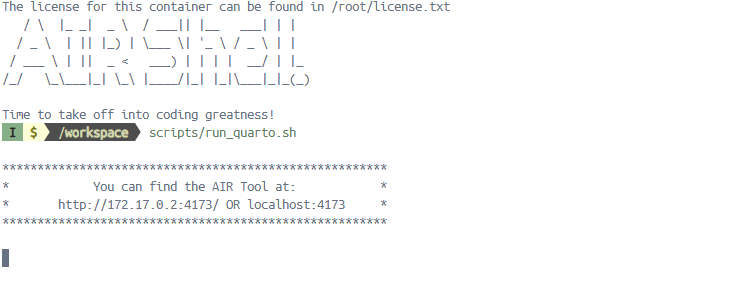
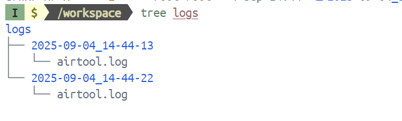
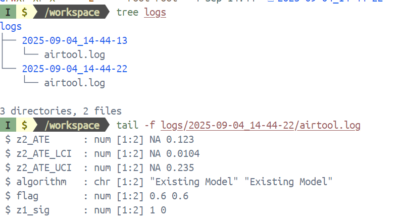

> Log Retrieval Instructions
>
> **1. Return to Docker Desktop**
>
> • If you wish to capture a log of activity occurring while you are
> using the AIR Tool, begin by returning to the Docker Desktop
> application. In Docker Desktop Terminal, the prompt should look like
> this:
>
>  style="width:5.43107in;height:2.1527in"
> alt="Text, letter AI-generated content may be incorrect." />
>
> • End the session by pressing **CTRL and C**, which should change the
> prompt to
>
>  style="width:3.83387in;height:0.48965in" />
>
> **2. Access Logs**
>
> • To view the logs, enter command:
>
> **tree logs**
>
> • Note the most recent log (example circled below).

> • To view log details, enter command using your log name:
>
> **tail -f logs/LOGNAME/airtool.log**
>
> **Example: tail -f logs/2025-09-04_14-44-22/airtool.log**
>
>  style="width:6.5in;height:1.96939in"
> alt="Text AI-generated content may be incorrect." />
